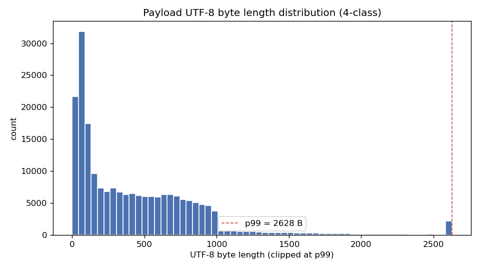
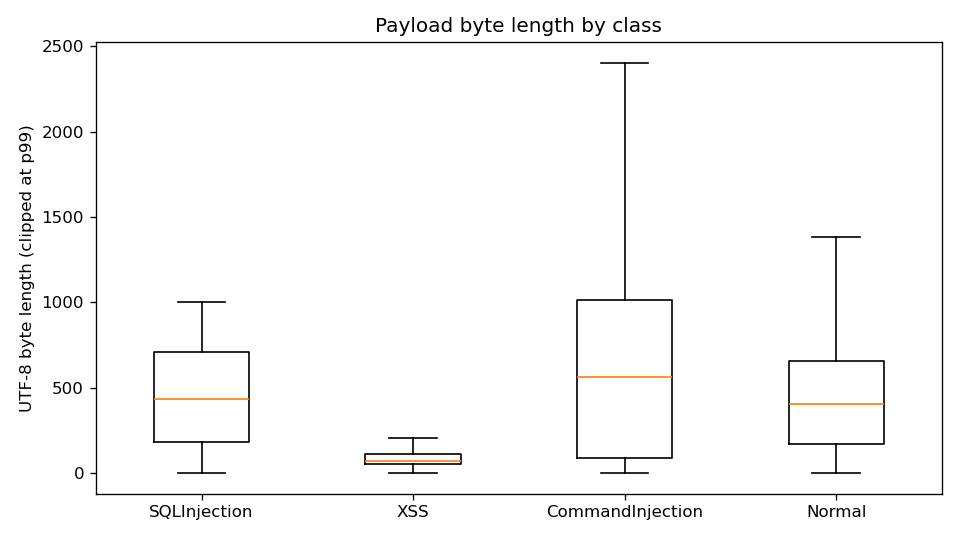
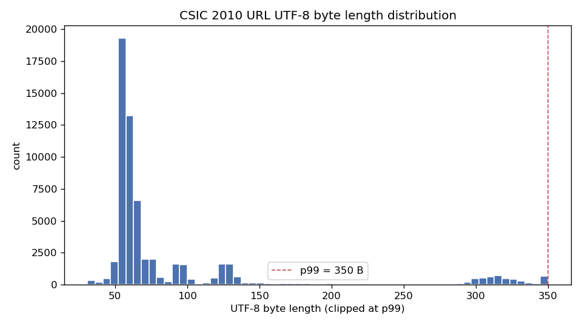

# EDA Notes — 페이로드 길이 분포 및 이미지 변환 폭(W) 결정

> 이 문서는 `python src/data/eda.py` 실행 시 자동 생성됩니다 (수기 편집 시 재실행하면 덮어써짐).
> 설계 문서 4장 Step 2(고정 폭 W 결정)의 데이터 근거 자료입니다.

- 커버리지 목표: 95% (잘림 없이 담기는 샘플 비율 기준)
- 후보 이미지 크기(한 변): [16, 24, 32, 48, 64]

---

## 1. 공격 페이로드셋 (4-class) 바이트 길이 분포

- 대상 파일: `data\raw\payload_3class\SQLInjection_XSS_CommandInjection_MixDataset.1.0.0.csv`

- **전체** (n=206,636)
    - min=1, mean=454.0, std=541.6, max=17,263
    - 백분위수: p50=315, p75=677, p90=926, p95=1184, p99=2628, p99.9=5413
- **SQLInjection** (n=57,316)
    - min=1, mean=455.5, std=294.4, max=1,003
    - 백분위수: p50=436, p75=710, p90=878, p95=940, p99=988, p99.9=1000
- **XSS** (n=40,799)
    - min=2, mean=102.5, std=119.5, max=8,493
    - 백분위수: p50=74, p75=113, p90=179, p95=256, p99=527, p99.9=1226
- **CommandInjection** (n=50,000)
    - min=1, mean=770.8, std=895.2, max=17,263
    - 백분위수: p50=566, p75=1013, p90=1768, p95=2433, p99=4256, p99.9=7331
- **Normal** (n=58,521)
    - min=1, mean=426.9, std=288.8, max=5,915
    - 백분위수: p50=406, p75=659, p90=827, p95=906, p99=985, p99.9=1408

### 후보 이미지 크기별 무손실 커버리지 (전체)

| 이미지 크기 | 용량(byte) | 무손실 커버리지 |
|---|---|---|
| 16×16 | 256 | 45.37% |
| 24×24 | 576 | 68.09% |
| 32×32 | 1,024 | 93.92% |
| 48×48 | 2,304 | 98.61% |
| 64×64 | 4,096 | 99.72% |

### 권장 크기 48×48(2,304B) 에서의 클래스별 무손실 커버리지

| 클래스 | 무손실 커버리지 | 잘리는 비율 |
|---|---|---|
| SQLInjection | 100.00% | 0.00% |
| XSS | 99.99% | 0.01% |
| CommandInjection | 94.30% | 5.70% |
| Normal | 99.98% | 0.02% |

---

## 2. CSIC 2010 HTTP 요청(URL) 바이트 길이 분포

- 대상 파일: `data\raw\csic2010\csic_database.csv` (컬럼: `URL`)
- 참고: CSIC 을 이미지화할 때 정확히 무엇을(URL만? URL+content? 전체 요청 직렬화?) 담을지는 Phase 3 에서 확정한다. 여기서는 우선 URL 길이만 본다.

- **URL 전체** (n=61,065)
    - min=31, mean=90.3, std=75.5, max=895
    - 백분위수: p50=59, p75=77, p90=138, p95=310, p99=350, p99.9=634
- **Normal(0)** (n=36,000)
    - min=48, mean=79.0, std=59.4, max=367
    - 백분위수: p50=58, p75=67, p90=122, p95=297, p99=325, p99.9=343
- **Anomalous(1)** (n=25,065)
    - min=31, mean=106.6, std=91.6, max=895
    - 백분위수: p50=64, p75=122, p90=300, p95=323, p99=384, p99.9=689

### 후보 이미지 크기별 무손실 커버리지 (URL)

| 이미지 크기 | 용량(byte) | 무손실 커버리지 |
|---|---|---|
| 16×16 | 256 | 92.09% |
| 24×24 | 576 | 99.87% |
| 32×32 | 1,024 | 100.00% |
| 48×48 | 2,304 | 100.00% |
| 64×64 | 4,096 | 100.00% |

---

## 3. 결론 — 권장 이미지 변환 폭(W)

- **권장 W = 48 (목표 이미지 48×48, 용량 2,304 byte)**
    - 근거: 페이로드셋 전체의 98.61% 가 잘림 없이 담김 (커버리지 목표 95% 를 만족하는 가장 작은 정사각 크기).
    - 변환 규칙(설계 4장): 높이 = ceil(바이트수 / W), 48×48 보다 짧으면 zero-padding, 길면 truncation.

### 유의사항 / 리스크
- **CommandInjection 롱테일**: CmdI 는 다른 클래스보다 페이로드가 훨씬 길어 권장 크기에서도 잘림이 이 클래스에 집중된다(위 '클래스별 커버리지' 표 참고). 잘림이 CmdI recall 을 떨어뜨릴 수 있으므로 이 표를 논문에 함께 보고하고, ablation 으로 32×32(더 작고 관례적)와 64×64(더 높은 커버리지)를 비교할 것.
- **CSIC 은 URL 만 보면 매우 짧다**(대부분 32×32 로 충분). 페이로드셋과 이미지 크기를 통일할지, 데이터셋별로 다르게 할지는 Phase 3 에서 실험 설계와 함께 결정한다.
- 여기 수치는 **중복 제거 전(raw)** 기준이다. 전처리(중복 제거·디코딩) 후 분포가 달라질 수 있으므로, 전처리 확정 후 이 스크립트를 재실행해 W 를 재검토할 것.

